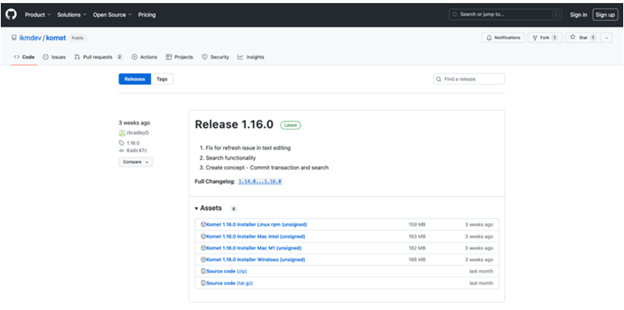
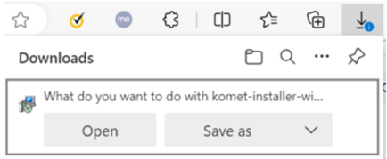
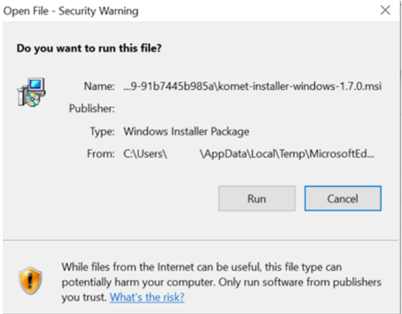
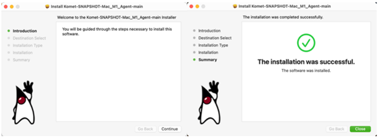
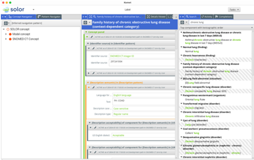
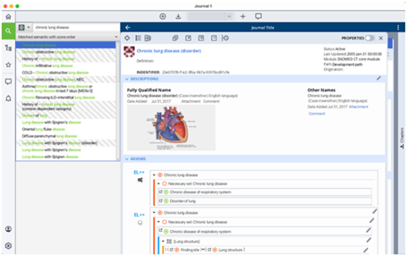
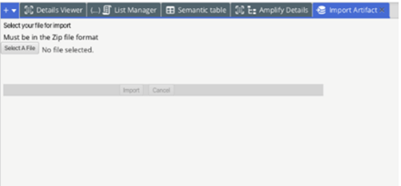

import Tabs from '@theme/Tabs';
import TabItem from '@theme/TabItem';

# Komet User Guide

## Downloading Komet

1. Use the [Komet Releases](https://github.com/ikmdev/komet/releases) link to download the latest Komet release build for your appropriate operating system.

2. Save the download file to the location of your choice
3. The Komet installer will automatically create a "Solor" folder in your <code>OSDisk (C:) -> Users -> [your personal user name]</code> folder 

<Tabs
  defaultValue="microsoftos"
  values={[
    {label: 'Microsoft OS', value: 'microsoftos'},
    {label: 'Apple iOS', value: 'ios'},
  ]}>

<TabItem value="microsoftos">

### Windows

1.	From your browser’s downloads, open the Komet Installer file

2.	A message will pop up asking if you want to run the Komet Installer File, click "Run"

3.	Once complete, nothing will automatically pop-up, so you will need to verify the install was successful by searching in your applications folder or your Operating System’s search feature for the Komet app

</TabItem>

<TabItem value="ios">

### iOS

1.	On Mac, run the installer and follow the onscreen installation instructions until installation is complete

2.	Once complete, nothing will automatically pop-up, so you will need to verify the install was successful by searching in your applications folder or your Operating System’s search feature for the Komet app

</TabItem>

</Tabs>

## First Time Set Up 
1.	*For Windows*, go to your search bar or apps folder and open “Komet”. *For Mac*, go to your applications folder, search for Komet, and run the desktop version Komet contributed application. 
2.	A Komet Startup window will open. Change data source to “Open SpinedArrayStore”
3.	Select the data source you would like to use and click “Ok” in the bottom right. Proceed to Step 8. 
4.	If you do not see a data source, copy and paste the zip file containing the desired data to the<code> OSDisk (C:) -> Users -> [your personal user name] -> Solor</code> folder 
5.	Right click the desired data zip file and select "Unzip Here" so the data is stored in the Solor folder 
6.	Exit and re-open Komet. Change the data source to “Open SpinedArrayStore”; your data source should appear
7.	Select the data source you would like to use and click “Ok” in the bottom right 

8.	Komet will open and load in with the 'default' view that consists of:
- The Navigation activity stream in the left-hand panel 
- The Detail Viewer activity stream in the center panel 
- The Search activity stream in the right-hand panel

9.	As a user, you can click and drag any of these activity streams into a different panel to reorganize as needed
10.	To view the new Komet prototype user interface (UI), go to the top menu and select Edit → New Journal on Windows or View → New Journal on Mac

A Journal window will appear with the new the prototype UI

## Importing and Reading-In Data
**Note:** This process is to import data after you have finished the initial Komet download and install process
1.	In the Detail Viewer activity stream (default location: center panel) click drop down button “+”, and click “Import Artifact"

2.	A “Select your file for import” window will pop up. Click on “Select A File” button

3.	Browse and select the zip file of your choice and click “Open” 
4.	A progress bar will monitor the import of your files 
5.	The files will be displayed in the left panel under “Concept Navigator”

